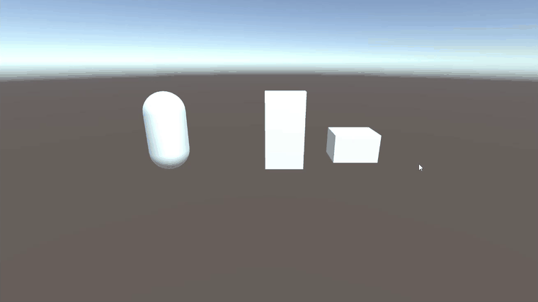
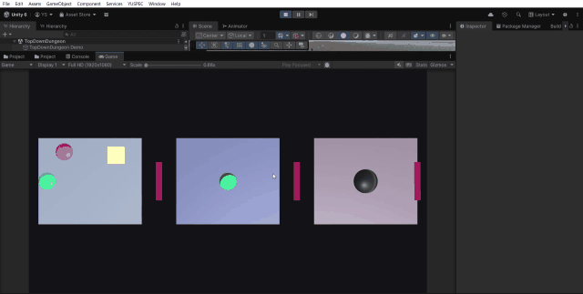

# YUSPEC

Write gameplay rules, not script spaghetti.

YUSPEC is a compact gameplay rule layer for Unity. It lets developers define
entities, events, conditions, actions, state machines, and scenario tests in
readable `.yuspec` files instead of scattering gameplay logic across hundreds of
C# MonoBehaviour scripts.



The current C++ compiler/runtime remains in the repository as the foundation.
The Unity package is now published as `YUSPEC Unity v1.1.1`: a Unity Package
Manager release with typed entity properties, clickable Unity diagnostics,
static analysis, ScriptableObject binding, lightweight dialogue, VS Code
language tooling, and real `.yuspec` hot reload.

## What YUSPEC Is

YUSPEC is:

- A gameplay rule and orchestration layer
- A text-based DSL for Unity
- A way to centralize gameplay logic
- A bridge to reusable C# actions
- A strict and debug-friendly way to model events and state

YUSPEC is not:

- A replacement for Unity
- A replacement for all C#
- A physics engine
- A shader or animation authoring system
- A full general-purpose programming language
- A visual scripting clone

## Current Status

YUSPEC Unity v1.1.1 is a public preview release for Unity Package Manager.

It includes a working gameplay rule runtime, C# action binding, strict
diagnostics, an Editor debugger, scenario/state-machine subsets, typed
properties, static analysis, ScriptableObject binding, dialogue blocks, real
hot reload, VS Code language tooling, and sample gameplay flows.

It is ready for experimentation, prototypes, small Unity projects, and feedback
from Unity developers. It is not yet battle-tested across large production
games.

Currently included:

- Unity package scaffold with runtime, editor, samples, docs, and tests
- Entity declarations and typed property bags
- Event handlers with optional `with` target and `when` condition
- Conditions for inventory-style `has`, equality, and state transitions
- C# action binding through `[YuspecAction]`
- Typed action arguments for `int`, `float`, `bool`, `string`, and `string[]`
- Built-in `set` plus common Unity-facing action stubs
- Behavior/state machine blocks with transitions, enter/exit/do actions, and `every` intervals
- Scenario tests with `given` / `when` / `expect`
- Runtime diagnostics, clickable Unity Console errors, and debugger trace
- Static analysis for cycles, repeated re-trigger loops, and unreachable states
- ScriptableObject binding through `from` and guarded write-back via `[YuspecMutable]`
- Lightweight `dialogue` blocks with `start_dialogue`
- FileSystemWatcher-based hot reload for changed `.yuspec` files
- VS Code extension for `.yuspec` editing
- Door+Chest and Demo Dungeon samples

Still intentionally limited:

- No visual graph editor
- No networking or replication layer
- No full general-purpose programming model
- Hot reload preserves entity values and rebuilds affected runtime registrations, but live scene migration remains out of scope
- Project-specific actions should still be implemented in C# for real games

## Feature Status

| Feature | Status |
|---|---|
| Unity Package Manager package | Public preview |
| Entity declarations | Working |
| Event handlers | Working |
| Conditions | Working subset |
| C# action binding | Working |
| Strict diagnostics | Working subset |
| Editor debugger | Working |
| Door+Chest sample | Working |
| GoblinAI state machine sample | Working subset |
| Quest/BossPhase samples | Working subset |
| DemoDungeon sample | Working sample |
| Scenario tests | Working subset |
| Typed entity properties | Working |
| Unity Console clickable diagnostics | Working |
| Static analysis | Working subset |
| ScriptableObject binding | Working |
| Dialogue blocks | Working |
| VS Code extension | Working |
| Hot reload | Working |
| Large production game validation | Not yet battle-tested |

## Install Via UPM

Add this dependency to your Unity project's `Packages/manifest.json`:

```json
"com.yuspec.unity": "https://github.com/Fovane/yuspec.git?path=/unity/Packages/com.yuspec.unity#v1.1.1"
```

Release notes: [docs/releases/v1.1.1.md](docs/releases/v1.1.1.md)

## VS Code Extension

The VS Code extension lives at:

```text
tools/vscode-yuspec
```

It provides syntax highlighting, keyword completion, hover descriptions,
go-to-definition for entity declarations, bracket matching, and save-time brace
diagnostics for `.yuspec` files.

Build and package it with:

```bash
cd tools/vscode-yuspec
npm install
npm run compile
npx @vscode/vsce package
```

## Known Limitations

- YUSPEC Unity v1.1.1 is a public preview release.
- State machine support is a working subset.
- Scenario tests are a working subset.
- Hot reload does not attempt live scene migration.
- The package has been validated on the documented Unity version, but wider Unity version coverage still needs community testing.
- It is not a replacement for Unity, all C#, physics systems, networking internals, shaders, animation authoring, or visual node editing.

## The Problem

Unity projects often grow into many small scripts:

```text
PlayerHealth.cs
EnemyAI.cs
EnemyAttack.cs
LootDrop.cs
DoorController.cs
QuestTrigger.cs
DialogueTrigger.cs
BossPhaseController.cs
WaveSpawner.cs
Checkpoint.cs
InventoryTrigger.cs
SaveTrigger.cs
```

After a while the hard questions are not about syntax. They are about visibility:

- Which script opens this door?
- Where does this quest start?
- Why did this loot not drop?
- Which object listens to this event?
- Where does this boss phase transition happen?
- Which Inspector reference is missing?

YUSPEC moves gameplay rules into visible `.yuspec` files while C# remains the
technical implementation layer for Unity-specific work.

## The Solution

YUSPEC sits between C# script spaghetti and node spaghetti: readable text-based
gameplay logic for Unity.

```text
.yuspec files
    v
YUSPEC parser / validator / runtime
    v
Unity runtime bridge
    v
GameObject / MonoBehaviour / ScriptableObject / EventSystem
```

C# actions are written once and bound by name:

```csharp
[YuspecAction("play_animation")]
public void PlayAnimation(YuspecEntity target, string animationName)
{
    target.GetComponent<Animator>().Play(animationName);
}
```

Gameplay designers and programmers can then orchestrate those actions in text.

## Why YUSPEC?

The `TopDownDungeon` and `PureCSharpDungeon` samples implement the same small
top-down dungeon:

- Player movement, health, and inventory
- Three rooms connected by locked doors
- Chest key pickup
- Merchant dialogue
- Goblin Chase/Attack/Dead state machine
- Boss Phase1/Phase2/Dead state machine
- Exit door opening on boss death
- Scenario checks for the core gameplay rules

The difference is where the gameplay logic lives.

Measured in the current repository, the YUSPEC gameplay rule surface is 221
lines across five `.yuspec` files. The equivalent pure C# sample is 628 lines
across three C# scripts. The YUSPEC sample also has 309 lines of C# bridge code
for primitive scene setup and input, but that code is deliberately infrastructure:
the gameplay rules remain in text files, and the reusable action bindings can be
shared by other demos.

| Concern | YUSPEC demo | Pure C# demo |
|---|---:|---:|
| Gameplay rule surface | 221 lines in `.yuspec` | 628 lines in C# scripts |
| Sample infrastructure | 309 lines of C# for setup/input | Included in the 628 C# lines |
| Files reviewers read for rules | 5 focused `.yuspec` files | 3 C# scripts with rules, setup, timers, and state mutation |
| Reusable action vocabulary | Shared `[YuspecAction]` verbs | Demo-specific methods and branches |

| Concern | YUSPEC demo | Pure C# demo |
|---|---|---|
| Entity data | Typed declarations in `.yuspec` | Fields spread across C# components |
| Chest rule | `on Player.Interact with Chest` | `switch` branch plus mutation code |
| Locked door rule | Declarative `when Player.has(Door.key)` | Manual inventory check in C# |
| Goblin AI | `behavior GoblinAI for Goblin` | Timer/state code in `Update()` |
| Boss phases | State transitions in `room3.yuspec` | Health thresholds and method calls in C# |
| Dialogue | `dialogue` block | Hard-coded log arrays/branches |
| Scenario tests | `scenario { given / when / expect }` | Custom C# test helper methods |
| Error surface | YUSPEC diagnostics with file/line/column | Compiler/runtime errors tied to scripts |
| Hot reload | Change `.yuspec`, runtime reloads changed file | Recompile scripts or enter play mode again |
| Designer review | Read gameplay rules as text | Read C# control flow |

In the YUSPEC version, the rule surface is split by concern:

```text
Samples~/TopDownDungeon/player.yuspec
Samples~/TopDownDungeon/room1.yuspec
Samples~/TopDownDungeon/room2.yuspec
Samples~/TopDownDungeon/room3.yuspec
Samples~/TopDownDungeon/dialogue.yuspec
```

The C# stays deliberately thin:

```text
YuspecDemoBootstrapper.cs  - scene setup and runtime registration
YuspecDemoInput.cs         - WASD/Space input bridge
YuspecUnityActions.cs      - reusable Unity action bindings
```

In the pure C# version, the same gameplay rules become script logic:

```text
Samples~/PureCSharpDungeon/Scripts/PureCSharpDungeonGame.cs
Samples~/PureCSharpDungeon/Scripts/PureCSharpDungeonEntity.cs
Samples~/PureCSharpDungeon/Scripts/PureCSharpDungeonInput.cs
```

That is fine for a tiny demo, but the shape does not scale well. A new door,
enemy phase, quest condition, or dialogue branch usually means editing compiled
C# code, adding more branches, and re-testing logic that is mixed with Unity
object setup. YUSPEC keeps the same orchestration in data-like gameplay files,
while C# remains the integration layer for input, movement, audio, UI, and other
engine-specific work.

The practical advantage is not that YUSPEC removes C#. It narrows C# to stable
verbs such as `open_door`, `give_item`, `take_damage`, and `show_ui_message`,
then lets gameplay rules compose those verbs in readable files with strict
diagnostics and scenario checks.



## Verified Vertical Slice: Door + Chest

The core working slice is intentionally concrete:

- Load a `.yuspec` file in Unity.
- Register scene entities.
- Emit `Player.Interact` with a target entity.
- Evaluate a simple condition.
- Execute actions such as `set`, `play_animation`, `play_sound`, and `give`.
- Record diagnostics and debug trace.

See:

`unity/Packages/com.yuspec.unity/Samples~/DoorExample/`

This is the intended manually testable slice for the v1.1.1 public preview package.

```yuspec
entity Player {
    inventory = ["IronKey"]
}

entity Door {
    state = Closed
    key = "IronKey"
}

entity Chest {
    state = Closed
    reward = "Gold"
}

on Player.Interact with Door when Player.has(Door.key):
    set Door.state = Open
    play_animation Door "Open"
    play_sound "door_open"

on Player.Interact with Chest when Chest.state == Closed:
    set Chest.state = Open
    give Player Chest.reward
    play_sound "chest_open"
```

## Supported v1.1 Syntax Examples

The following examples show the supported v1.1 subset. The language remains small
on purpose; C# actions still carry the technical Unity implementation.

### Goblin AI

```yuspec
entity Goblin {
    health: int = 30
    damage: float = 5.0
    alive: bool = true
    drops: string = "GoldCoin"
    tags: string[] = ["enemy", "goblin"]
}

behavior GoblinAI for Goblin {
    state Idle {
        on PlayerSeen -> Chase
    }

    state Chase {
        every 0.2s:
            move_towards Player speed 3

        on InAttackRange -> Attack
        on PlayerLost -> Idle
    }

    state Attack {
        every 1s:
            damage Player by self.damage

        on PlayerOutOfRange -> Chase
        on self.health <= 0 -> Dead
    }

    state Dead {
        do:
            spawn self.drops at self.position
            destroy self
    }
}
```

### Scenario Tests

```yuspec
scenario "door opens with key" {
    given Player has "IronKey"
    when Player.Interact Door
    expect Door.state == Open
}
```

### ScriptableObject Binding

```yuspec
entity PlayerConfig from "Assets/Data/PlayerConfig.asset" {
    health: int
    moveSpeed: float
}
```

Initial values are read from the referenced Unity asset. Runtime write-back is
allowed only for fields or properties marked with `[YuspecMutable]`.

### Dialogue

```yuspec
dialogue "MerchantGreeting" for Merchant {
    line "Welcome, traveler."
    choice "What do you sell?" -> MerchantShop
    choice "Goodbye." -> end
}

on Player.TalkTo with Merchant:
    start_dialogue "MerchantGreeting"
```

Dialogue is handled by `YuspecDialogueRuntime` through C# events for lines,
choices, and end events. It does not depend on Yarn Spinner.

### Boss Room Orchestration

```yuspec
on Player.EnterBossRoom with BossRoom:
    set BossRoom.state = Open
    play_music "boss_theme"

on Boss.HealthBelow:
    set_state Boss Phase2
    play_cutscene "BossPhase2Intro"

on Boss.Died:
    set ExitDoor.state = Open
    give Player "AncientKey"
```

## Strict Mode

Unity usage should default to strict validation. Silent typo-based failure is a product bug, not a feature.

Implemented now:

- Empty action name
- Duplicate action binding name
- Unknown action during direct runtime execution
- Unknown action while loading specs
- Wrong action argument count while loading specs
- Wrong argument type where literals can be checked safely
- Unknown entity in handler, condition, action, or value reference
- Unknown property in condition, set action, or value reference
- Empty event name
- Duplicate entity id in the scene
- Duplicate state
- Duplicate event handler
- Unreachable state
- Unknown transition target
- Type mismatch in typed entity declarations
- Event handler cycles
- Repeated interval re-trigger loops
- ScriptableObject asset/type binding errors
- Dialogue reference errors

Still planned:

- Typo-based null fallback
- Richer type inference for entity references and project-specific action args

See [docs/strict-mode.md](docs/strict-mode.md) for the current split between implemented and planned diagnostics.

## Visual Debugging

The YUSPEC Debugger shows the runtime surface needed for v1.1.1 iteration:

- Loaded specs
- Parse errors
- Strict diagnostics
- Registered actions
- Scene entities
- Current states
- Recent events
- Executed actions
- Failed conditions
- Scenario results
- Hot reload status and reloaded handler counts

The goal is to answer "which rule controlled this?" directly inside the Unity
Editor.

## Unity Package

The Unity package scaffold lives at:

```text
unity/Packages/com.yuspec.unity
```

It includes the UPM manifest, runtime assembly, editor assembly, sample `.yuspec`
files, package docs, and a debugger window under:

```text
Window > YUSPEC > Debugger
```

The package is intentionally honest: v1.1.1 is a focused public preview Unity
gameplay rule layer, not a replacement for Unity or C#. The shipped samples
exercise events, actions, conditions, state machines, scenarios, typed
properties, dialogue, ScriptableObject binding, hot reload, and debugger trace.

## Unity Dev Environment

The repository includes a Unity 6000.3.8f1 development project at:

```text
unity/YuspecUnityDev
```

It consumes the package from:

```text
unity/Packages/com.yuspec.unity
```

Use it to compile the package, rebuild the Door+Chest example scene, and
validate the runtime slice while developing the language. See
[docs/unity-dev-environment.md](docs/unity-dev-environment.md).

## Existing C++ Runtime

The existing C++ implementation is still available:

- `compiler/` contains lexer, parser, AST, diagnostics, and semantic analysis.
- `runtime/` contains entity, event bus, state machine, and interpreter pieces.
- `tools/yuspec1_cli/` contains the current CLI.
- `examples/` contains legacy/general DSL examples.

See [docs/legacy-examples.md](docs/legacy-examples.md) for how the old examples
fit into the new Unity-focused product direction.

Early launch positioning and Reddit feedback notes live in
[docs/reddit-launch.md](docs/reddit-launch.md).

## Roadmap

Phase 0: Repo pivot
- Done: README, docs, Unity examples, and package scaffold.

Phase 1: Unity package scaffold
- Done: UPM manifest, asmdefs, runtime classes, editor debugger, samples.

Phase 2: Action registry
- Done: reflection-based C# action discovery, duplicate detection, argument validation,
  and unknown action diagnostics.

Phase 3: Minimal parser/runtime for event handlers
- Done: Door+Chest vertical slice with entity properties, event handlers, conditions,
  `set`, C# action execution, strict diagnostics, and debugger trace.

Phase 4: State machines
- Done in v1 subset: behavior blocks, state transitions, current state tracking, intervals, and
  state entry actions.

Phase 5: Scenario tests
- Done in Unity package subset: `given` / `when` / `expect` and debugger result view.

Phase 6: Demo Dungeon
- Done as package sample: key, locked door, chest, goblin, quest, boss room, boss phase, and exit flow.

Phase 7: Publish readiness
- Done for v1.1.0: UPM package, samples, tests, documentation, changelog,
  release tag, demo GIF, VS Code extension, and Unity 6.3.8f1 validation.
- Still in progress: Asset Store preparation and broader production feedback.

Phase 8: Hardening
- Richer Unity event payloads, CI automation, production service bindings,
  broader Unity version coverage, and live scene migration research.

## Build Current CLI

The current C++ CLI can still be built:

```bash
cmake -S . -B build
cmake --build build --target yuspec1 --config Debug
```

Run a legacy scenario:

```bash
./build/Debug/yuspec1 test examples/testing/01_scenario.yus
```

## License

[MIT](LICENSE) - Copyright (c) 2026 Yucel Sabah.
