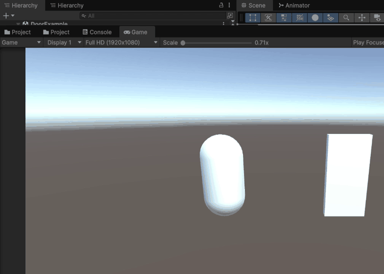

# YUSPEC

Write gameplay rules, not script spaghetti.

YUSPEC is a compact gameplay rule layer for Unity. It lets developers define
entities, events, conditions, actions, state machines, and scenario tests in
readable `.yuspec` files instead of scattering gameplay logic across hundreds of
C# MonoBehaviour scripts.



The current C++ compiler/runtime remains in the repository as the foundation.
The Unity direction starts with documentation, examples, and a Unity Package
Manager scaffold while the Unity parser/runtime integration is built in vertical
slices.

## What YUSPEC Is

YUSPEC is:

- A gameplay rule and orchestration layer
- A text-based DSL for Unity
- A way to centralize gameplay logic
- A bridge to reusable C# actions
- A strict and debug-friendly way to model events and state

YUSPEC is not:

- A replacement for Unity
- A replacement for all C#
- A physics engine
- A shader or animation authoring system
- A full general-purpose programming language
- A visual scripting clone

## The Problem

Unity projects often grow into many small scripts:

```text
PlayerHealth.cs
EnemyAI.cs
EnemyAttack.cs
LootDrop.cs
DoorController.cs
QuestTrigger.cs
DialogueTrigger.cs
BossPhaseController.cs
WaveSpawner.cs
Checkpoint.cs
InventoryTrigger.cs
SaveTrigger.cs
```

After a while the hard questions are not about syntax. They are about visibility:

- Which script opens this door?
- Where does this quest start?
- Why did this loot not drop?
- Which object listens to this event?
- Where does this boss phase transition happen?
- Which Inspector reference is missing?

YUSPEC moves gameplay rules into visible `.yuspec` files while C# remains the
technical implementation layer for Unity-specific work.

## The Solution

YUSPEC sits between C# script spaghetti and node spaghetti: readable text-based
gameplay logic for Unity.

```text
.yuspec files
    v
YUSPEC parser / validator / runtime
    v
Unity runtime bridge
    v
GameObject / MonoBehaviour / ScriptableObject / EventSystem
```

C# actions are written once and bound by name:

```csharp
[YuspecAction("play_animation")]
public void PlayAnimation(YuspecEntity target, string animationName)
{
    target.GetComponent<Animator>().Play(animationName);
}
```

Gameplay designers and programmers can then orchestrate those actions in text.

## Door Interaction

```yuspec
entity Door {
    state = Closed
    key = "IronKey"
}

on Player.Interact with Door when Player.has(Door.key):
    set Door.state = Open
    play_animation Door "Open"
    play_sound "door_open"
```

## Goblin AI

```yuspec
entity Goblin {
    health = 30
    damage = 5
    drops = "GoldCoin"
}

behavior GoblinAI for Goblin {
    state Idle {
        on PlayerSeen -> Chase
    }

    state Chase {
        every 0.2s:
            move_towards Player speed 3

        on InAttackRange -> Attack
        on PlayerLost -> Idle
    }

    state Attack {
        every 1s:
            damage Player by self.damage

        on PlayerOutOfRange -> Chase
        on self.health <= 0 -> Dead
    }

    state Dead {
        do:
            spawn self.drops at self.position
            destroy self
    }
}
```

## Scenario Test

```yuspec
scenario "door opens with key" {
    given Player has "IronKey"
    when Player.Interact Door
    expect Door.state == Open
}
```

## Boss Room Orchestration

```yuspec
on Player.EnterZone("BossRoom"):
    lock Door.BossRoom
    spawn Boss at BossSpawnPoint
    play_music "boss_theme"

on Boss.HealthBelow(50%):
    set_state Boss Phase2
    play_cutscene "BossPhase2Intro"

on Boss.Died:
    unlock Door.Exit
    give Player "AncientKey"
```

## Strict Mode

Unity usage should default to strict validation. Silent typo-based failure is a
product bug, not a feature.

Planned strict mode diagnostics include:

- Unknown action
- Unknown entity
- Unknown property
- Wrong argument count
- Wrong argument type
- Duplicate state
- Duplicate event handler
- Unreachable state
- Unknown transition target
- Typo-based null fallback

## Visual Debugging Goal

The YUSPEC Debugger should show:

- Loaded specs
- Parse errors
- Strict diagnostics
- Registered actions
- Scene entities
- Current states
- Recent events
- Executed actions
- Failed conditions
- Scenario results

The goal is to answer "which rule controlled this?" directly inside the Unity
Editor.

## Unity Package

The Unity package scaffold lives at:

```text
unity/Packages/com.yuspec.unity
```

It includes the UPM manifest, runtime assembly, editor assembly, sample `.yuspec`
files, package docs, and a debugger window under:

```text
Window > YUSPEC > Debugger
```

The scaffold is intentionally honest: it does not pretend the full DSL runtime is
complete. The Door-style subset now has a minimal Unity parser/runtime slice;
state machines, scenarios, and the Demo Dungeon remain roadmap work.

## Unity Dev Environment

The repository includes a Unity 6000.3.8f1 development project at:

```text
unity/YuspecUnityDev
```

It consumes the package from:

```text
unity/Packages/com.yuspec.unity
```

Use it to compile the package, rebuild the Door example scene, and validate the
runtime slice while developing the language. See
[docs/unity-dev-environment.md](docs/unity-dev-environment.md).

## Existing C++ Runtime

The existing C++ implementation is still available:

- `compiler/` contains lexer, parser, AST, diagnostics, and semantic analysis.
- `runtime/` contains entity, event bus, state machine, and interpreter pieces.
- `tools/yuspec1_cli/` contains the current CLI.
- `examples/` contains legacy/general DSL examples.

See [docs/legacy-examples.md](docs/legacy-examples.md) for how the old examples
fit into the new Unity-focused product direction.

## Roadmap

Phase 0: Repo pivot
- README, docs, Unity examples, and package scaffold.

Phase 1: Unity package scaffold
- UPM manifest, asmdefs, runtime classes, editor debugger, samples.

Phase 2: Action registry
- Reflection-based C# action discovery, duplicate detection, argument validation,
  and unknown action diagnostics.

Phase 3: Minimal parser/runtime for event handlers
- Door example vertical slice: entity properties, one event handler, one
  condition, and action execution.

Phase 4: State machines
- Behavior blocks, state transitions, current state tracking, intervals, and
  state entry actions.

Phase 5: Scenario tests
- `given` / `when` / `expect`, Unity editor scenario runner, and CLI runner.

Phase 6: Demo Dungeon
- Key, locked door, chest, goblin, quest, boss room, boss phase, and exit flow.

Phase 7: Publish readiness
- UPM quality, samples, tests, documentation, changelog, license, release zip,
  demo video, and Asset Store preparation.

## Build Current CLI

The current C++ CLI can still be built:

```bash
cmake -S . -B build
cmake --build build --target yuspec1 --config Debug
```

Run a legacy scenario:

```bash
./build/Debug/yuspec1 test examples/testing/01_scenario.yus
```

## License

[MIT](LICENSE) - Copyright (c) 2026 Yucel Sabah.
